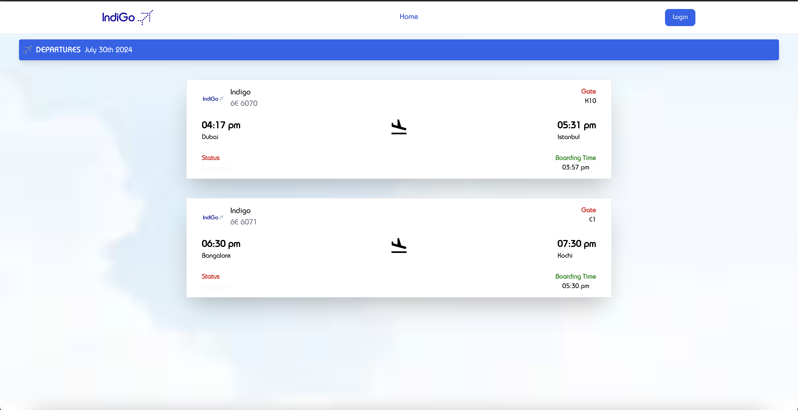
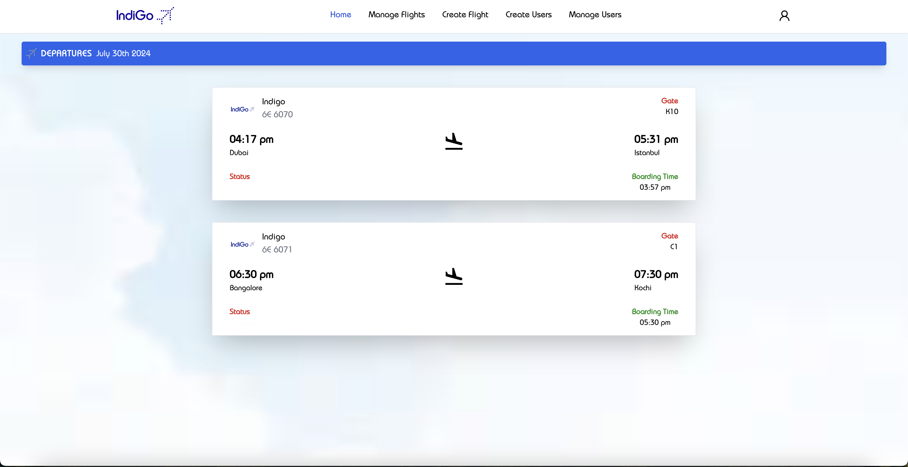
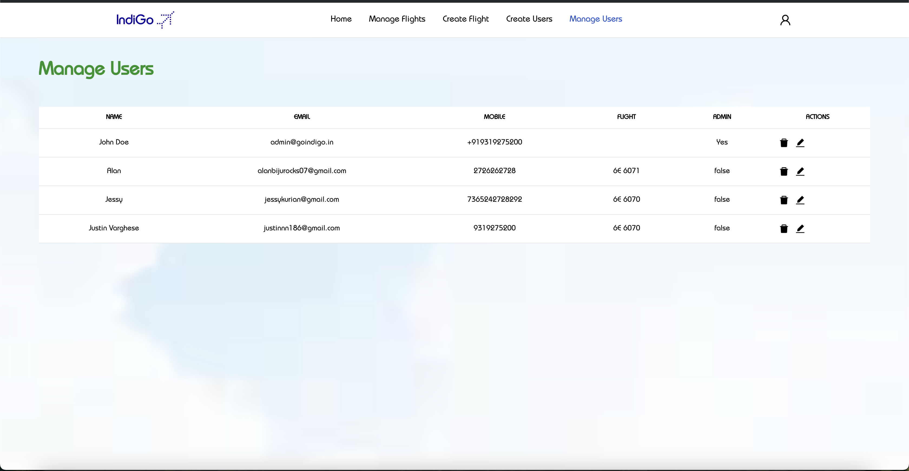
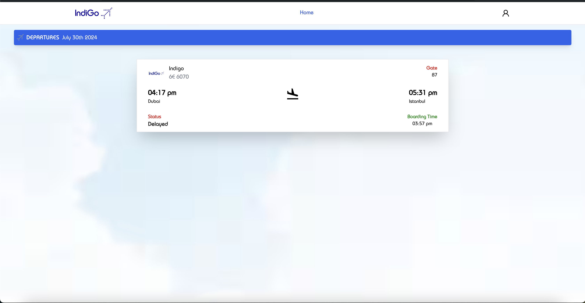

# INDIGO HACK TO HIRE - 2024

## Frontend

### SCREENSHOTS

### Home Screen

### Login Screen

### Admin User Screen

### Admin Manage Flights

### Admin Create Users

### Admin Manage Users

### User Home Screen

- When a non admin user logs in the home screen will get his flight which he is travelling
- Takes his notification token and saves in Database

### Description

This project is a frontend application built with React.js, utilizing React Query for data fetching and state management. It includes CRUD functionalities for managing fleets and users, and integrates Firebase Cloud Messaging for push notifications.

### Features

- **CRUD Operations for Fleet Management**: Create, Read, Update, Delete fleet details.
- **CRUD Operations for User Management**: Create, Read, Update, Delete user details.
- **Firebase Messaging**: Push notifications for real-time updates.
- **Flight Listings**: List available flights.
- **Email Notifications**: Send email notifications for updates.

### Tech Stack

- React.js
- React Query
- Firebase Messaging

### Installation Steps

`git clone   cd   npm install  npm run start`

## Backend

### Features

- **CRUD Operations for Fleet Management**: Create, Read, Update, Delete fleet details.
- **CRUD Operations for User Management**: Create, Read, Update, Delete user details.
- **Firebase Messaging**: Push notifications for real-time updates.
- **Updating Flight Data**: Send notifications to users when flight data is updated.
- **Email Notifications**: Send email notifications for updates.

### Installation Steps

`git clone   cd   pip install -r requirements.txt  python3 main.py`

### Limitations and Future Enhancements

- **Time Complexity**: To handle background tasks and improve API response times, integrating Redis and Celery would be better as it will handle the notification within the app and the api would respond effectively, time constraints prevented implementation.
- **Optional Integrations**: Could integrate SMS notifications via Twilio, but time constraints prevented implementation.

## Author

### Name - Justin Varghese

### Contact - 9319275200
